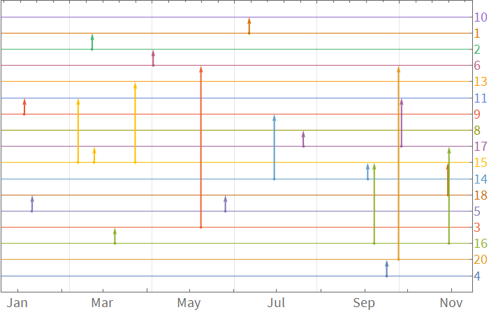

# MDataUtilities

Data wrangling and visualization utilities for Mathematica


## Installation
 
### Manual
 
   Go to 'releases' tab and download appropriate .paclet file.
    
   Run `PacletInstall @ path/to/the.paclet` file
   
### Via WRF:GitHubInstall
   
    ResourceFunction["GitHubInstall"]["kubapod", "MDataUtilities"]

## Load


```mathematica
<< MDataUtilities`
```

## Examples


### TimelineGraph


```mathematica
$entities = Range@20;
SeedRandom[10];
$events = Table[
 <|
  "date" -> RandomDate[DateObject@{2020, 1, 1}, Today],
  "entityIds" -> RandomSample[$entities, 2]
  |>
 , 20];
```

```mathematica
TimelineGraph[$events, ImageSize -> 700]
```




