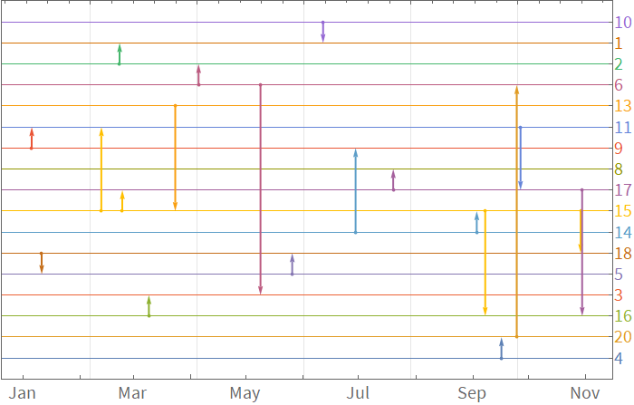

# MDataUtilities

Data wrangling and visualization utilities for Mathematica


## Installation
 
### Manual
 
   Go to 'releases' tab and download appropriate .paclet file.
    
   Run `PacletInstall @ path/to/the.paclet` file
   
### Via WRF:GitHubInstall
   
    ResourceFunction["GitHubInstall"]["kubapod", "MDataUtilities"]

## Load


```mathematica
<< MDataUtilities`
```

### Examples

#### TimelineGraph

```
$entities = Range@20;
SeedRandom[10];
$events = Table[
   <|
    "date" -> RandomDate[DateObject@{2020, 1, 1}, Today],
    "entityIds" -> RandomSample[$entities, 2]
    |>,
   20
   ];

TimelineGraph[$events, ImageSize -> 700]

```



#### GroupByMerge

```
$dataset = {<|"a" -> 1, "c" -> 2|>, <|"a" -> 1, "b" -> 2|>, <|
    "a" -> 2, "c" -> 1|>};

GroupByMerge[$dataset, Key["a"], First]

(*{<|"a" -> 1, "c" -> 2, "b" -> 2|>, <|"a" -> 2, "c" -> 1|>}*)
```

#### EnumerateRecords

```
EnumerateRecords@$dataset

(*{<|"a" -> 1, "c" -> 2, "index" -> 1|>, <|"a" -> 1, "b" -> 2, 
  "index" -> 2|>, <|"a" -> 2, "c" -> 1, "index" -> 3|>}*)

EnumerateRecords[$dataset, "pos"]

(*{<|"a" -> 1, "c" -> 2, "pos" -> 1|>, <|"a" -> 1, "b" -> 2, 
  "pos" -> 2|>, <|"a" -> 2, "c" -> 1, "pos" -> 3|>}*)
```

#### ApplyKeyAdd

```
ApplyKeyAdd["x" -> (#a^2 &)] /@ $dataset

(*{<|"a" -> 1, "c" -> 2, "x" -> 1|>, <|"a" -> 1, "b" -> 2, 
  "x" -> 1|>, <|"a" -> 2, "c" -> 1, "x" -> 4|>}*)
```