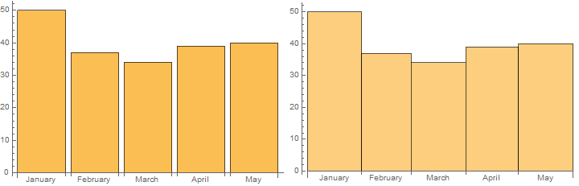

# MDataUtilities

Data wrangling and visualization utilities for Mathematica

## Installation

### Manual

Go to ‘releases’ tab and download appropriate .paclet file.
 
Run `PacletInstall @ path/to/the.paclet` file


### Via WRF: GitHubInstall

```
ResourceFunction["GitHubInstall"]["kubapod", "MDataUtilities"]
```

## Load

```
<< MDataUtilities`

```

## Examples

### Visualization

#### TimelineGraph

```
$entities = CharacterRange["a", "j"];
SeedRandom[10];
$events = Table[
    <|
     "date" -> ResourceFunction["RandomDate"][{DateObject@{2020, 1, 1}, Today}],
     "entityIds" -> RandomSample[$entities, 2] 
    |>, 
    20 
   ];

TimelineGraph[$events, ImageSize -> 700]

```


### Wrangling

#### GroupByMerge

```
$dataset = {<|"a" -> 1, "c" -> 2|>, <|"a" -> 1, "b" -> 2|>, <|"a" -> 2, "c" -> 1|>}; 
 
GroupByMerge[$dataset, Key["a"], First]

(*{<|"a" -> 1, "c" -> 2, "b" -> 2|>, <|"a" -> 2, "c" -> 1|>}*)
```

#### EnumerateRecords

```
EnumerateRecords@$dataset

(*{<|"a" -> 1, "c" -> 2, "index" -> 1|>, <|"a" -> 1, "b" -> 2, "index" -> 2|>, <|"a" -> 2, "c" -> 1, "index" -> 3|>}*)

EnumerateRecords[$dataset, "pos"]

(*{<|"a" -> 1, "c" -> 2, "pos" -> 1|>, <|"a" -> 1, "b" -> 2, "pos" -> 2|>, <|"a" -> 2, "c" -> 1, "pos" -> 3|>}*)
```

#### ApplyKeyAdd

```
ApplyKeyAdd["x" -> (#a^2 &)] /@ $dataset

(*{<|"a" -> 1, "c" -> 2, "x" -> 1|>, <|"a" -> 1, "b" -> 2, "x" -> 1|>, <|"a" -> 2, "c" -> 1, "x" -> 4|>}*)
```

### DateTools

#### DateHistogramList 

Nothing fancy, just using internal ``System`TimeVisualizationsDump`dateHistogramBinning``.

```
$dates = AbsoluteTime /@ RandomChoice[DateRange[{2010, 1, 1}, {2010, 5, 31}, "Day"], 200];
$bSpec = "Month"; 
 
$dhl = DateHistogramList[$dates, $bSpec]

(*{{3471292800, 3473971200, 3476390400, 3479068800, 3481660800, 3484339200}, {40, 39, 37, 36, 48}}*)

Row@{
   BarChart[$dhl[[2]], ChartLabels -> (DateString[#, "MonthName"] & /@ $dhl[[1]]), ImageSize -> 360], 
   DateHistogram[$dates, $bSpec, ImageSize -> 360] 
  }
```

